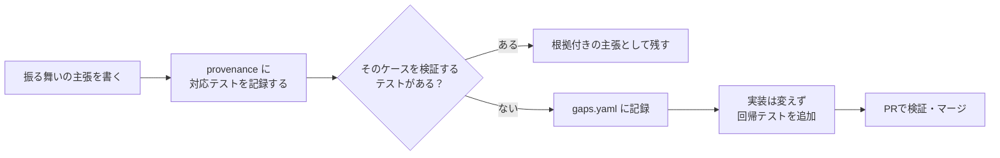

# ドキュメントの根拠を追っていたら、回帰テストの抜けが2件見つかった

## ドキュメントを書いていたら、テストの抜けが見つかった

[`agent-cost`](https://github.com/shiki-yusuke/agent-cost) という小さな OSS CLI を公開しています。Claude Code / Codex CLI のローカル利用ログを読み込み、トークンコストを見積もるツールです。

このツールのドキュメントを整えながら、そこに書く主張をコードやテストと一つずつひも付けていました。その作業中に、回帰テストがないケースを2つ見つけました。

どちらのコードも、すでに意図したとおりに動いていました。見つけたのは実装バグではなく、その挙動を将来の変更から守るテストの抜けです。2件とも実装には手を入れず、回帰テストだけを追加しました。

きっかけは、主張の根拠として具体的なテストを挙げようとしたことでした。

まずソースを読み、次に対応するテストを探す。キャッシュ書き込み TTL の内訳を扱う箇所でテストを追っていると、内訳が一部だけ入っているケースが見当たりませんでした。価格ステータスを集約する処理でも同じように調べたところ、`lower_bound` と `priced` が混在するケースを直接確認するテストがありませんでした。

「あれ、このケースはどこで確認しているんだろう」と思い、手が止まりました。

見つけた2件を `docs/claims/gaps.yaml` に `GAP-01`、`GAP-02` として記録し、それぞれ小さな PR にしました。この記事では、なぜドキュメントの根拠を追う作業がテストの抜けにつながったのか、その過程を書きます。

## なぜ根拠を書くと、テストの抜けが見えるのか

`agent-cost` には、すでに README も docstring もありました。README には「What this measures, and what it doesn't」というセクションがあり、`price_fact()` の docstring には下限値として扱う理由も書いてあります。README や docstring を丁寧に書くのは大切です。

ただ、文章だけなら、ソースを読んで挙動を確認した時点で書けてしまいます。「TTL の内訳が不完全な入力を使ったテストはあるか」まで調べなくても、docstring の説明は正確に書けました。

主張の根拠には、具体的なテスト名を記録しようとしていました。「この挙動を確認しているのはどのテストか」と聞かれると、ソースを読んだだけでは答えられません。テストファイルを開き、入力と期待値を確認し、そのケースを本当に通しているかを見る必要があります。

普通の README では、実行して確かめた主張と、ソースを読んで妥当だと判断した主張が同じように見えます。根拠を具体的なテストまで絞ると、その差がはっきりします。

作業の流れを図にすると、こうなります。



この分岐で、2回「ない」に進みました。

## 見つかった2件

既存テストが押さえていたのは、どちらのロジックも両端のケースでした。抜けていたのは、その中間です。コードを目で追うと自然に動きそうに見えるので、そこで確認を終えてしまいやすい箇所でした。

| ギャップ | 正しい既存挙動 | 足りなかったテスト | 追加したもの |
| --- | --- | --- | --- |
| GAP-01（`agent_cost/readers/claude.py` の `parse_session_facts`） | `cache_creation` dict の内訳が総数に足りない場合、差分を `cache_write_unknown` として出力する | 内訳 dict が*存在するが不完全*な中間ケース（既存テストは「内訳が総数とぴったり一致」「内訳が一切ない」の両端のみをカバー） | `test_cache_creation_partial_ttl_breakdown_leftover_is_unknown`（[PR #2](https://github.com/shiki-yusuke/agent-cost/pull/2)、マージ済み） |
| GAP-02（`agent_cost/aggregate.py` の `_STATUS_RANK` / `build_rows`） | 行の `pricing_status` は、構成ファクトのうち最も悪いステータス（`unpriced` < `lower_bound` < `priced`）になる | `lower_bound` ファクトと `priced` ファクトを混ぜたときに行が `lower_bound` になるケース（既存テストは `unpriced` 側の混在しかカバーしていなかった） | テスト4件（[PR #3](https://github.com/shiki-yusuke/agent-cost/pull/3)、マージ済み、詳細は下記） |

GAP-01 で入力に使ったのは、`cache_creation_input_tokens` の合計300に対し、`ephemeral_5m_input_tokens=150`、`ephemeral_1h_input_tokens=100` というケースです。`cache_write_5m=150` と `cache_write_1h=100` に加え、残りの50トークンが `cache_write_unknown=50` として出力されるところまでアサートしています。PR の説明にも、`leftover` の計算はすでにこのとおりに動作していたと明記されています。

:::details GAP-02 で追加した4件のテスト名

- `test_build_rows_all_priced_facts_mark_row_priced`（ベースライン）
- `test_build_rows_mixed_priced_and_lower_bound_marks_row_lower_bound`（これまで未検証だったケース。`lower_bound` ファクトと `priced` ファクトを混ぜた行が `lower_bound` になることを確認）
- `test_build_rows_mixed_lower_bound_and_unpriced_marks_row_unpriced`
- `test_build_rows_worst_status_ranking_is_order_independent`（同じ3つのファクトを3種類の順序で構築しても、結果のステータスが変わらないことを確認）

:::

両 PR は 2026-08-14 にマージされました。差分と CI の結果は、それぞれの PR から確認できます。

これで、たとえば `_STATUS_RANK` の値が後のリファクタで入れ替わったり、`leftover` の計算が変わったりしたときに、CI で検知できます。追加前は、コスト見積もりの下限値が変わっても赤くなるテストがありませんでした。

## evidence-docs ではどうやっているか

[`evidence-docs`](https://github.com/shiki-yusuke/evidence-docs) も、自分で開発しているツールです。

これを使い、`agent-cost` の **claim corpus（主張集）** を作っていました。この corpus には、5つの `topic` に分けた17件の `observation` があります。扱っているのは、価格カタログの検証ルール、キャッシュ書き込みの下限値挙動、未価格ファクトの扱い、金額計算での Decimal 使用、`measure` コマンドの v1 契約です。

`observation` は、「振る舞い」「不変条件」「意思決定記録」といった一つの主張を表します。それぞれに `claim_kind`、検証の強さを示す `epistemic_status`、根拠を記録する `provenance` を持たせます。

`epistemic_status` には固定の語彙があり、`execution_verified` から `model_inference` / `single_source_observation` / `recorded_decision` までのいずれかを指定します。主張と合わせて、どの程度まで確認したのかも記録します。

`provenance` は1件以上のエントリを持つリストです。各エントリに記録するのは、次の5項目です。

- `source_kind`：`source` / `test` / `spec` / `review_memory` のいずれか
- `uri`：リポジトリからの相対パス
- `selector`：対象となるテスト、関数、セクション
- `content_digest`：根拠となる内容のダイジェスト
- `repo_commit`：ダイジェストを取得した時点のコミット

`epistemic_status` と `provenance` は省略できません。未知の `source_kind` も受け付けず、すぐにエラーにします。以前は未知の値を黙ってスキップしていましたが、タイプミスも不正なエントリも見逃すため、今はエラーとして扱います。リポジトリ外の情報を指す `review_memory` では、`content_digest` の形式だけを検証します。

今回の OBS-004 はキャッシュ書き込み TTL に関する主張、OBS-010 は価格ステータスの順序に関する主張です。この2件の `provenance` を埋めるために対応テストを探し、「この特定のサブケースを確認するテストがない」と分かりました。そこで見つかった抜けを、GAP-01 と GAP-02 として `gaps.yaml` に記録しました。

## どこまで検証できるのか

`evidence-docs validate` は、万能な真実性チェッカーではありません。記録の構造と、リポジトリ内の根拠が指定されたコミットの内容と一致するかを検証するツールです。検証範囲を表にまとめます。

| `validate` が検証すること | 検証しないこと |
| --- | --- |
| provenance の形式・種別（未知の `source_kind` は即リジェクト） | 主張の文章そのものが真実かどうか |
| `source` / `test` / `spec` の `content_digest` が指定コミット時点の git blob と一致するか | 著者が実際に十分ギャップを探したか（`gaps.yaml` の網羅性） |
| corpus 内で `--repo-commit` とすべての `valid_at_commit` / `provenance[].repo_commit` が一致しているか | 他リポジトリでも同じ効果が出るか |
| パストラバーサル（`..`・絶対パス）の拒否 | `epistemic_status` の申告が正直かどうか（`negation_check` は任意項目） |

:::details ダイジェスト検証が「宣言コミットの git blob 照合」に落ち着くまでの3段階

1. フォーマットだけを調べる（「64桁の16進か」）。これでは、ファイルが変更された後の古いダイジェストも通ります。
2. ワークツリーにある現在のファイルのハッシュと照合する。古いダイジェストは検知できますが、ファイルを編集してダイジェストを再計算し、`repo_commit` だけ古い SHA のまま残すケースは通ってしまいます。
3. 宣言されたコミット自体の git blob（`git show <repo_commit>:<uri>` の結果を sha256 でハッシュ）と照合する。現在はこの方法です。

:::

ワークツリーの内容が宣言コミットの blob と異なる場合は、警告に留めます。corpus は特定時点のスナップショットで、その後もリポジトリは更新されるからです。ただし、*宣言コミット自体の* blob と `content_digest` が一致しない場合は、常に致命的なエラーになります。

パストラバーサルは、2つの独立したガードで防いでいます。`git show` はファイルシステムを直接参照しないため、ワークツリーのパス解決とは別に検査が必要です。

## この経験から分かったこと

今回おもしろかったのは、`validate` コマンドがギャップを自動発見したわけではないことです。

気づいたのは、`validate` を実行する前です。`provenance` に具体的なテストを指定しようとして、テストを読み直したときでした。根拠を正直に書こうとしたことで、「このケースは確認できていない」と分かりました。

この仕組みにも限界があります。ソースを読んだだけの主張に `execution_verified` と書くことは今もできます。`negation_check` はその確認を助けますが、任意項目なので強制はされません。`gaps.yaml` が空でも、構文上は有効です。

この corpus には GAP-03 もあります。README にある価格についての3つの主張を `rates.json` と照合し、乖離がなかったという記録です。探索の結果が「見つからなかった」場合も残そうと、自分で判断して記録しました。

この結果だけで、手法に一般的な効果があるとは言えません。1つの小さなリポジトリで corpus を1回作ったところ、回帰テストの抜けが2件見つかったという n=1 の経験です。一般的な効果量や、ほかのリポジトリでの発見率は測っていません。同じ作業を別のコードで試せば、何も見つからないかもしれませんし、別の種類のギャップが出るかもしれません。

自分のコードについて「正しいはず」と書いたあと、「それを直接確認しているテストはどれか」まで追ってみる。そこで見つかったのが、この2件でした。

## 自分でも試すには

最小限なら、次の手順で試せます。

```bash
pip install evidence-docs

evidence-docs init docs/claims
# topics/、observations/、id-registry.yaml、gaps.yaml、README.md を雛形生成

# 自分が正しいと考えている振る舞いについて observation を1件書き、
# それを確認する具体的なテストを指定した provenance を付けます。
# 指定できるテストがなければ、それがギャップです。

evidence-docs validate docs/claims --repo-commit "$(git rev-parse HEAD)"
```

`validate` は、未登録の ID、未知の `source_kind`、指定コミットの git blob と一致しないダイジェストなどをリジェクトします。テストの抜けが見えるのは、その手前で `provenance` を埋めているときです。

## リンク

- [`shiki-yusuke/agent-cost`](https://github.com/shiki-yusuke/agent-cost) — claim corpus の対象となったリポジトリ
- [`shiki-yusuke/evidence-docs`](https://github.com/shiki-yusuke/evidence-docs) — claim corpus ツール本体
- [`agent-cost#2`](https://github.com/shiki-yusuke/agent-cost/pull/2) — GAP-01 の回帰テスト追加（マージ済み）
- [`agent-cost#3`](https://github.com/shiki-yusuke/agent-cost/pull/3) — GAP-02 の回帰テスト追加（マージ済み）
- `agent-cost` の `docs/claims/gaps.yaml` — ギャップ台帳（GAP-01・GAP-02・GAP-03）
- `evidence-docs` の `docs/schema.md` — 本記事で参照した trust boundary の全文
- [English version (canonical)](https://github.com/shiki-yusuke/evidence-docs/blob/main/docs/articles/writing-evidence-linked-docs-exposed-two-missing-regression-tests.md) — 本記事の元になった英語版
